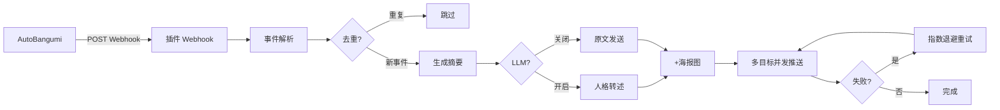
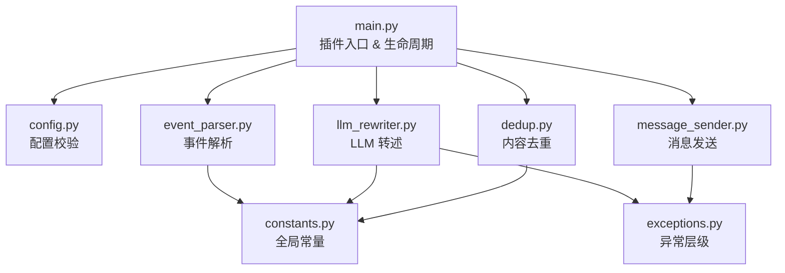

<div align="center">

# astrbot_plugin_autobangumi_notify

**AutoBangumi → AstrBot 通知转发插件**

让 AutoBangumi 的新番更新通知，以你机器人的口吻推送到 QQ

[]()
[](LICENSE)
[](https://github.com/AstrBotDevs/AstrBot)
[](https://github.com/Pueriz/AutoBangumi)
[](https://www.python.org/)

[功能](#功能) · [快速开始](#快速开始) · [配置](#配置) · [事件类型](#事件类型) · [排障](#常见问题) · [架构](#架构)

</div>

---

> **前置依赖**：本插件是 [AstrBot](https://github.com/AstrBotDevs/AstrBot) 的插件，需要配合 [AutoBangumi](https://github.com/Pueriz/AutoBangumi) 使用。请确保已部署并配置好这两个项目。

## 功能

| 功能 | 说明 |
|------|------|
| 🎯 多事件识别 | 自动区分新番更新、下载、重命名、错误等 6 种事件，每种生成不同摘要 |
| 👥 多目标推送 | 同时推送给多个好友和群聊，自由组合 |
| 🎭 人格转述 | 以 AstrBot 自身人格转述通知（不绑定固定人设），也可自定义转述风格 |
| 🚫 智能去重 | 同一事件在时间窗口内只推一次，避免重复轰炸 |
| 🔄 自动重试 | 发送失败指数退避重试，不丢通知 |
| 🖼️ 海报贴图 | 自动附带番剧海报 |
| ⚙️ 全 WebUI 配置 | 所有配置在 AstrBot 面板修改，无需改代码 |
| 🔙 旧版兼容 | `target_qq` 自动迁移到新版多目标配置 |

---

## 快速开始

### 1. 安装

将插件文件夹放入 AstrBot 插件目录：

```bash
# Docker 部署
<挂载目录>/data/plugins/astrbot_plugin_autobangumi_notify/

# 源码部署
<AstrBot 根目录>/data/plugins/astrbot_plugin_autobangumi_notify/
```

重启 AstrBot 或在 WebUI 插件管理中启用。

### 2. 配置推送目标

打开 AstrBot WebUI → 插件设置 → `astrbot_plugin_autobangumi_notify`：

**推荐方式（多目标）**：

```json
"targets": [
  {"type": "friend", "id": "你的QQ号"},
  {"type": "group", "id": "你的群号"}
]
```

**简单方式（单个好友）**：直接填 `target_qq` 为你的 QQ 号即可。

### 3. 配置 AutoBangumi

在 AutoBangumi WebUI → 设置 → 通知 → 添加 Webhook 渠道：

- **URL**：`http://<你的服务器IP>:6185/api/autobangumi/notify`
- **模板（推荐）**：
  ```json
  {
    "event": "{{event}}",
    "title": "{{title}}",
    "season": "{{season}}",
    "episode": "{{episode}}",
    "poster_url": "{{poster_url}}",
    "torrent_name": "{{torrent_name}}",
    "file_name": "{{file_name}}",
    "size": "{{size}}",
    "error_msg": "{{error_msg}}",
    "message": "{{message}}"
  }
  ```

### 4. 测试

```bash
curl -X POST http://<IP>:6185/api/autobangumi/notify \
  -H "Content-Type: application/json" \
  -d '{"title":"测试番剧","season":1,"episode":3}'
```

收到消息即链路通畅。

---

## 架构

### 工作流程



### 模块结构



---

## 配置

所有配置在 AstrBot WebUI → 插件设置中修改，即时生效。

### 核心配置

| 配置项 | 类型 | 默认值 | 说明 |
|--------|------|--------|------|
| `targets` | list | `[]` | 推送目标列表，格式：`[{"type":"friend\|group","id":"QQ号或群号"}]` |
| `target_qq` | string | 空 | **旧版**：单个好友 QQ 号 |
| `platform_id` | string | `aiocqhttp` | 消息平台 ID |
| `use_llm` | bool | `true` | 是否用 LLM 转述 |
| `webhook_path` | string | `/api/autobangumi/notify` | Webhook 路径 |

### LLM 转述

| 配置项 | 类型 | 默认值 | 说明 |
|--------|------|--------|------|
| `llm_system_prompt` | string | 空 | **任务指令**。如"用傲娇的语气转述"。留空则机器人以自身人格自由发挥 |

> ⚠️ **不要在这里写人格定义**（如"你是xxx"）。机器人的人格由 AstrBot 自身的 Provider 配置决定，插件只告诉 LLM 「做什么」。

### 去重 & 重试

| 配置项 | 类型 | 默认值 | 说明 |
|--------|------|--------|------|
| `enable_dedup` | bool | `true` | 是否开启去重 |
| `dedup_window_seconds` | number | `300` | 去重时间窗口（秒），默认 5 分钟 |
| `max_retries` | number | `3` | 发送失败最大重试次数 |
| `retry_delay_seconds` | number | `2.0` | 重试基础延迟（指数增长：2→4→8...） |

---

## 事件类型

| 类型 | 什么时候触发 | LLM 收到的摘要 |
|------|-------------|---------------|
| `new_episode` | RSS 抓到新集 | "番剧《xxx》第1季第3集 有更新" |
| `download_start` | 开始下载 | "番剧《xxx》开始下载 S01E03" |
| `download_complete` | 下载完成 | "番剧《xxx》下载完成（大小: 500MB）" |
| `rename_complete` | 刮削/入库完成 | "番剧《xxx》已整理完成" |
| `download_error` | 下载失败 | "番剧《xxx》下载失败：timeout" |
| `rss_error` | RSS 抓取异常 | "RSS 抓取异常：connection refused" |

> 在 AutoBangumi 模板中加入 `"event": "{{event}}"` 字段可让识别更精确。不加入也能通过字段组合自动推断。

---

## 常见问题

### 收不到消息

1. 检查 `targets` 或 `target_qq` 是否填写正确
2. 检查 AstrBot 端口 `6185` 是否对 AutoBangumi 可达
3. 查看 AstrBot 日志：`docker logs astrbot | grep -i autobangumi`
4. 确认插件在 WebUI 插件列表中已启用

### 日志显示成功但 QQ 没收到

- 私聊：确认机器人与目标 QQ 是好友
- 群聊：确认机器人已在群内
- 检查 `platform_id` 是否匹配（NapCat/OneBot 为 `aiocqhttp`）

### 同一条通知反复推送

- 检查 `enable_dedup` 是否为 `true`
- AutoBangumi 可能配了多个通知渠道，只保留一个 webhook
- 适当增大 `dedup_window_seconds`（如 600 = 10 分钟）

### LLM 转述失败

- 检查 AstrBot 是否已配置 LLM Provider
- 不影响功能——失败时自动用原文发送
- 查看日志确认具体错误

### 发送群聊失败

- 确认 `targets` 中 `type` 为 `"group"`
- 部分平台限制群聊主动发言，取决于消息平台实现

### 网络不通

- Docker Compose 部署：将 AB 和 AstrBot 加入同一自定义网络
- 或使用宿主机 IP 替代 localhost

---

## 推荐搭配

| 插件 | 说明 |
|------|------|
| [AutoBangumi](https://github.com/Pueriz/AutoBangumi) | 全自动追番工具，本插件的数据来源 |
| [NapCat](https://github.com/NapNeko/NapCatQQ) | QQ 机器人框架，与 AstrBot 搭配使用 |

---

## 许可

MIT © yometenma
